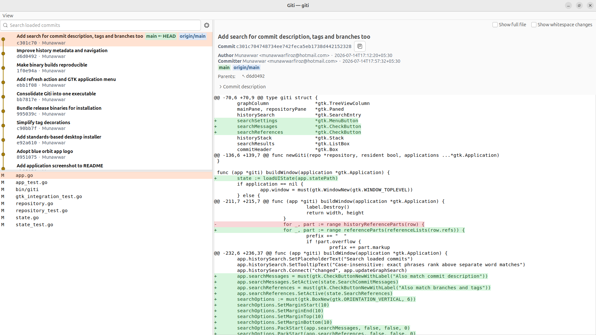

# Giti - a `gitk` alternative

<p align="center">
  
</p>

A git history diff viewer for linux meant to be invoked quickly from a terminal (with window maximized), for the hybrid TUI-GUI workflow loving devs.

Keeping bloat low and starting up quickly were important design choices for repeat invokes from terminal. giti cold starts in ~200ms and warm starts in <100ms.

`giti` coincidentally 
means world/universe and life in Persian.



```sh
giti # uses HEAD by default
giti branch/tag/SHA
giti file-name

giti --forground main # without resident process
giti -1 # force restart resident window
```

## Installation

The Linux x86_64 release binary is included in `bin/`, so most users can install
without Go or a compiler. Giti requires GTK 3.24 or newer (Ubuntu 20.04+):

```sh
./install.sh
```

The installer asks whether to build fresh; choose **No** to install the bundled
non-debug Linux x86_64 binary. On Ubuntu it installs missing GTK 3 runtime
libraries and Git, then installs Giti to `~/.local/bin` and its desktop entry
and hicolor icon to `~/.local/share`. This makes the Giti icon work in GNOME
Wayland as well as X11. It also installs Bash, Zsh, and Fish completions, so
typing `giti R<Tab>` offers matching repository paths alongside local branches,
remote branches, and tags.
Installation is idempotent: rerunning the installer updates the same files
without adding anything to your shell startup files.

Choose **Yes** at the prompt, or use `./install.sh --build`, to compile from
source. That path requires Go 1.24 or newer and GTK 3.24 or newer development
files; install Go using the official
[Go installation instructions](https://go.dev/doc/install). The installer
automatically installs missing Ubuntu build dependencies too.

For a system-wide `/usr/local` installation, use:

```sh
./install.sh --system
```

Remove the corresponding user or system installation with:

```sh
./uninstall.sh
./uninstall.sh --system
```

Uninstalling leaves shared system libraries and Giti's user preferences intact.

You can then run `giti`, `giti main`, `giti v1.0.0`, or
`giti <sha>` from any repository.

If GTK 3 is installed at runtime but its development package is unavailable and
you cannot use `sudo`, `./bootstrap-dev-deps.sh` downloads the needed Ubuntu
development packages into the ignored `.deps` directory. The build scripts use
that private copy automatically. It can be deleted after installing
`libgtk-3-dev` system-wide.

## Features / Deets

The initial history contains unstaged and staged entries when present, followed by 50 commits. Select a history entry, then a changed file, to view only that file's stacked diff. **Whitespace changes** are shown by default; disable the option to use Git's `--ignore-all-space` filtering.

For performance the graph initially shows 50 commits. Use **Load more** when that is not enough. Opening a parent that has not been loaded yet automatically reads older history, up to a safety limit of 5,000 commits.

Use **View → Refresh** or press **F5** to reread the graph and working-tree changes while keeping the current view when possible.

Enable **Show full file** to expand the selected diff with the unchanged surrounding lines. The option resets when the selection changes and is disabled for files larger than 2 MiB to avoid accidentally rendering an enormous document.

Rendered patches are capped at 8 MiB. Giti terminates larger diff output and shows a truncation notice instead of retaining an unbounded patch in memory. Hiding the resident window also releases its history, file list, and diff contents.

### Cold start improvement with a background process

The first normal invocation starts the sole resident as a detached background
process, so its terminal returns immediately. Closing its window hides the
resident for up to 12 hours, and a later invocation reuses it. A second
invocation while the resident window is busy opens an independent one-shot
window instead. `giti -1`
terminates the recorded resident and starts a fresh one. A process lock enforces
the single-resident rule even when launch commands race. Resident output is
written to `$XDG_RUNTIME_DIR/giti.log` (or `/tmp/giti-$UID/giti.log` when that
variable is unset).

Use `giti -f` or `giti --foreground` for a one-shot app attached to the
terminal. It bypasses the resident, can run alongside it, forwards terminal
signals, and exits when its window closes.

Open file/directory search by passing a path directly. The regular graph remains
complete: select a search result to reveal that commit in its branch context,
then use the back button to return to the results. The path stays editable in
the search bar. Use `--` when it could be confused with a revision or begins
with a dash:

```sh
giti README.md
giti docs/
giti main -- README.md
```

For a single file, `--follow` continues history across renames:

```sh
giti --follow -- README.md
```

The search options popover switches between commit-text and file-history modes.
Text mode scans the complete commit history in cancellable background batches
and can additionally match commit descriptions and references. File mode loads
the newest 50 matches initially, can load older matches in batches of 100, and
can follow one file across renames. An optional starting revision and
`-f`/`--foreground` can be combined with these forms. Revision ranges and other
`git log` flags are not currently accepted.

## Debugging a crash

The debug build retains symbols and disables compiler optimization:

```sh
./build-debug.sh
GOTRACEBACK=crash bin/giti-debug -f HEAD 2>&1 | tee /tmp/giti-crash.log
```

Reproduce the crash, then keep `/tmp/giti-crash.log`. If Ubuntu reports a
core dump, `coredumpctl info giti-debug` shows its metadata and
`coredumpctl debug giti-debug` opens it in GDB. Foreground mode is ephemeral,
so the debug app can run alongside the resident without using its socket.

## License

Giti is free software licensed under the
[GNU General Public License, version 2 or later](LICENSE). Its graph lane
layout includes an adaptation of gitg's GPL-licensed implementation.
